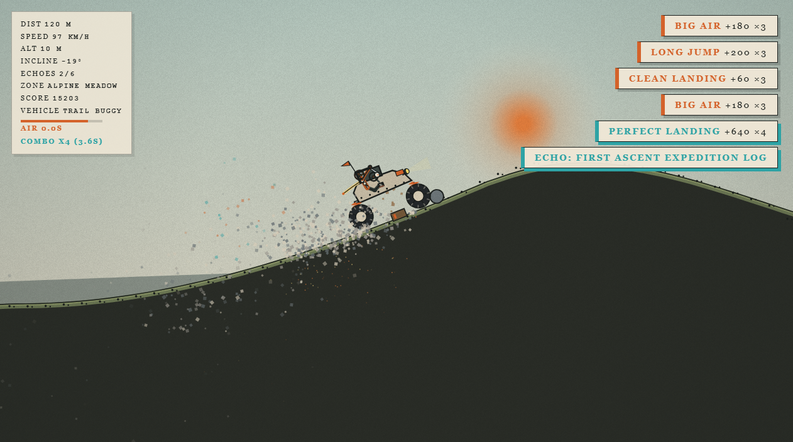
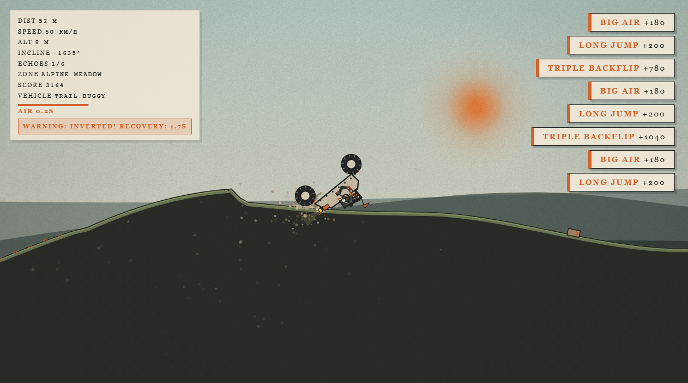

# Old Mountain Works

> **Authentic physics-driven 2.5D mountain climbing and destruction driving game built with Matter.js & Three.js.**

🎮 **Play Live**: [https://letmecodex.github.io/old-mountain-works/](https://letmecodex.github.io/old-mountain-works/)



---

## Overview

**Old Mountain Works** is a physics-obsessed expedition driving game inspired by the tactile, springy two-pedal balance of classic mountain climbing games like *Hill Climb Racing*.

The game combines a **Matter.js** rigid-body simulation engine with a **Three.js** 2.5D visual layer, dynamic atmospheric lighting, particle emitters, procedural spline terrain, articulated ragdoll driver mechanics, and breakable environmental structures.

---

## Key Features

- **Authentic Two-Pedal Driving & Air Physics**:
  - **GAS (`D` / `→` / `W`)**: Drives wheels forward with energetic torque. Accelerating hard creates a natural, springy wheelie lift. In the air, immediately pitches the chassis **nose UP** (counter-clockwise) for controlled backflips.
  - **BRAKE / REVERSE (`A` / `←` / `S`)**: Brakes and reverses wheels, compressing front suspension into the dirt. In the air, pitches the chassis **nose DOWN** (clockwise) for controlled frontflips and matching landing slopes.
- **Non-Inverting Swingarm + Strut Suspension**:
  - Trailing and leading radius swingarms (`stiffness: 0.90, damping: 0.06`) paired with Hooke spring struts (`stiffness: 0.12, damping: 0.08`). Eliminates 2D constraint reflection bugs and keeps wheels strictly below the chassis frame.
- **Inverted Self-Righting Roll Recovery**:
  - Resting upside down on the roll cage allows the player to rock the chassis with `A`/`D` to pop back onto four wheels.
- **Articulated Ragdoll Driver**:
  - Multi-joint driver (torso, head, arms) that responds dynamically to g-forces, steering torque, and performs emergency collision tucking during rollovers.
- **Environmental Destruction**:
  - Physics-driven destructible crates, splintering wooden bridges, rolling boulders, and reactive loose debris.
- **2.5D Visual Depth**:
  - Three.js multi-plane parallax backdrop, alpine atmospheric fog, dynamic sun flare, and wheel particle spray.
- **Garage & Tuning Workshop**:
  - Real-time vehicle tuning for suspension stiffness, tire friction, engine torque, and vehicle archetype switching (Trail Buggy, Rock Crawler, Rally Special).
- **Relic Exploration & Echoes**:
  - Mountain Echo Relics placed across hazardous peaks with proximity lore and reward scoring.

---

## Screenshots

| High-Speed Alpine Climb | Stunt Air Time & Landings |
|:---:|:---:|
|  |  |

---

## Controls

| Action | Primary Key | Secondary Key | Description |
|---|---|---|---|
| **Gas / Throttle** | `D` | `Arrow Right` / `W` | Accelerate forward / Pitch nose up in air |
| **Brake / Reverse** | `A` | `Arrow Left` / `S` | Brake / Reverse / Pitch nose down in air |
| **Rock Vehicle** | `A` / `D` | `Arrow Left` / `Right` | Rock chassis when resting on roof to self-right |
| **Restart Run** | `R` | — | Reset vehicle to checkpoint / start line |
| **Garage / Workshop** | `G` | — | Open live vehicle tuning workshop |
| **Diagnostic Overlay** | `F3` | — | Toggle physics body telemetry and bounds |
| **Mute Audio** | `M` | — | Toggle sound effects and engine synthesizer |

---

## Architecture & Code Structure

```
├── index.html                  # Playable game entrypoint (GitHub Pages ready)
├── old-mountain-works.html     # Standalone distribution build
├── assemble_final.py           # Multi-part engine compiler & HTML bundler
├── gen_part1.py                # Part 1: Config, Math & Biomes
├── gen_part2.py                # Part 2: Procedural Spline Terrain Generator
├── gen_part3.py                # Part 3: Destructibles, Props & Audio Synthesizer
├── gen_part4.py                # Part 4: Matter.js Vehicle, Swingarm Suspension & Driver
├── gen_part5.py                # Part 5: Three.js 2.5D Scene, VFX & Camera Director
├── gen_part6.py                # Part 6: Game Loop, HUD, Stunt Recognizer & Garage UI
├── verify_all_systems.js       # 18-stage automated integration test suite
└── screenshots/                # Visual verification captures
```

---

## Running Locally

### Option 1: Direct File
Simply open `index.html` or `old-mountain-works.html` in any modern web browser (Chrome, Edge, Firefox, Safari).

### Option 2: Local HTTP Server
```bash
# Using Python
python -m http.server 8000

# Using Node.js
npx serve .
```
Navigate to `http://localhost:8000`.

---

## Verification & Automated Testing

The repository includes a comprehensive 18-test integration test suite covering physics stability, C1 terrain continuity, air stunts, archetype switching, and 0-console error auditing:

```bash
node verify_all_systems.js
```

All 18 tests pass with 100% success rate.

---

## License

MIT License. Crafted with Matter.js and Three.js.
